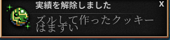

# Cookie Clicker


## Cookie Clicker とは

『クッキークリッカー』（Cookie Clicker）は、2013年8月8日に公開されたブラウザゲームで、作者はOrteilことジュリアン・シーノット（Julien Thiennot）というフランスのプログラマーである。

### 概要

画面に現れるクッキーを1回クリックするごとに1枚（アイテムで1クリックあたりの枚数を増やすことができる）クッキーを焼くことができる。焼いたクッキーはクッキーの生産施設購入費用に充てることができ、次第に大量のクッキーが手に入るようになる仕組みをとっている。

クッキーで購入できる施設には、10秒に1枚のクッキーを生産できる「カーソル」をはじめ、1秒毎に1クッキーの「グランマ（おばあさん）」といった具合に、「宇宙船」、「タイムマシン」、「反物質コンデンサ」、「プリズム」などがあり、それらによってさらに多くのクッキー生産が可能となる。また、それらの施設単体のクッキー生産能力を強化（アップグレード）することも可能である。クッキー生産量の単位は「Cps（Cookies per second）」と呼ばれる。ごく稀に画面上に「ゴールデンクッキー」が現れ、これをクリックすることで一時的にクリック、および施設のクッキー生産能力が強化されたり、大量のクッキーを入手できる。ある程度までクッキーを焼くと、一度リセットしたうえで永続的な効果を持つ特殊なクッキーと名声レベルを獲得したうえで周回プレイが可能になる。


[【クッキーおばあさん】飽きるまでクッキークリッカー【なちょこのアルバイト】](https://www.youtube.com/watch?v=jlPD-sEcP-A)


## Cookie Clicker Hacking

Cookie Clicker のプログラムコードを書き換えることによってクリックを自動化したり，アイテムを取得したり，ゴールデンクッキーを出現させたりすることができる。

### Cookie Clicker サイト

- [本家サイト](http://orteil.dashnet.org/cookieclicker/)
- [日本語版](http://natto0wtr.web.fc2.com/CookieClicker/)
- [コード](./src/main.js)

### 準備(ブラウザの開発コンソールを出す)

1. [ゲーム画面を開く](http://natto0wtr.web.fc2.com/CookieClicker/)
2. キーボードの入力を半角モードへ
3. (ctrl + shift + I or F12) または 右クリックのメニューから検証を選択
4. Consoleのタブを選択
5. (ctrl + l) コンソールの消去


#### Hack してみよう

// 5506行目 Game.Prompt=function(content,options,updateFunc,style)


``` js
Game.Prompt('Hack this site! wwwwwwwwwww')
```

- 半角英数字で入力!!  大文字と小文字もきちんと!!
- 表示する文字列を任意の文字列にかえてみよう〜
- 表示する文字列はシングルクォーテーション `'` でくくること

#### クッキーをズルして増やしてみよう

// 1387行目 Game.cookies=0;//cookies


```
Game.cookies = 99999
```



